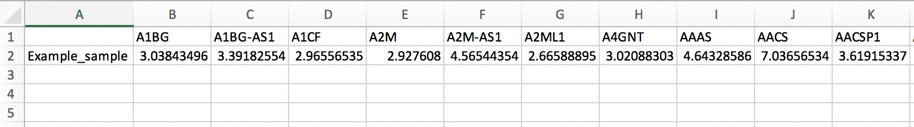
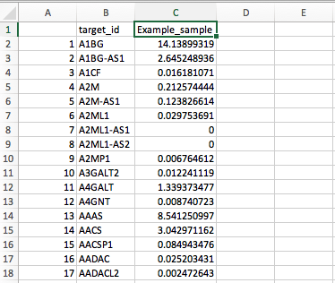

# DiSCoVER (v1.0)

This is a Python implementation of DiSCoVER, intended to be used for drug recommendation based on RNA-seq expression (e.g., the results from Kallisto).

Module author: Edwin Juarez

For a demonstration of how to use this module, visit https://notebook.genepattern.org/services/sharing/notebooks/353/preview/  

Contact: https://groups.google.com/forum/?utm_medium=email&utm_source=footer#!forum/genepattern-help

Algorithm Version: DiSCoVER 1.0

<!-- ## Summary
*To be added* -->

## References

DiSCoVER paper:
- https://www.ncbi.nlm.nih.gov/pmc/articles/PMC5055054/
- https://www.ncbi.nlm.nih.gov/pmc/articles/PMC5055054/?report=reader
- http://clincancerres.aacrjournals.org/content/22/15/3903
- Hanaford, A. R., Archer, T. C., Price, A., Kahlert, U. D., Maciaczyk, J., Nikkhah, G., … Raabe, E. H. (2016). DiSCoVERing Innovative Therapies for Rare Tumors: Combining Genetically Accurate Disease Models with In Silico Analysis to Identify Novel Therapeutic Targets. Clinical cancer research : an official journal of the American Association for Cancer Research, 22(15), 3903–3914. doi:10.1158/1078-0432.CCR-15-3011

<!-- *More to be added* -->

<!-- ### Functionality yet to be implemented:
*To be added* -->

<!-- ### Technical notes:
*To be added* -->

## Parameters

### -->gene_expression
type=str  
The csv file which contains the gene expression to be used [(read below for details on format)](#csv-format)  

### -->select_control
type=str (choice: 'Custom', 'Cerebellar stem cell', or 'Neural stem cell')  
Which control to use. If 'Custom' is selected, the parameter `control` needs to be used to provide the file with the control gene expression.  
default='Custom'  

### -->control
type=str,  
The csv file which contains the gene expression of the control [(read below for details on format)](#csv-format)  
default=''  

### CSV format
Two of the inputs of the DiSCoVER module are gene expression files formatted as CSV. These can be generated using Kallisto or manually by ensuring the CSV files meet the requirements below.

There are two acceptable formats for these CSV files:

1- "Wide" CSV (as created by the Kallisto module). This CSV must have 2 rows and multiple columns. The element on the first column and first row is not used so it can be left blank. The element on the first column and second row will be the name of the sample. The rest of the columns contain paired information: on the first row the gene name and on the second row the quantified gene expression.  

2- "Tall" CSV. This CSV must have **three** columns and multiple rows. The elements on the first row and the first and second column are not used so they can be left blank. The element on the first row and third column will be the name of the sample. The rest of the rows contain three pieces of information: the index on the first column, the name of the gene on the second column, and the quantified gene expression on the third column.  

## License

DiSCoVER itself and this GenePattern module are distributed under a modified BSD license. This module's license is available at https://github.com/genepattern/DiSCoVER/blob/master/LICENSE

## Platform Dependencies
Task Type: Drug recommendation  
CPU Type: Any  
Operating System: Any  
Language: Python 3.7  

Version Comments  
Version	Release Date	Description  
0.1	2019-05-21	Initial release of DiSCoVER  
1.0 2019-09-09 Updating parameter user-friendliness
